<!-- _class: cover -->

  

    
PLATAFORMA GR · EXPERIENCIA INTEGRAL

    <h1>Una operación premium, de principio a fin</h1>
    
Autoservicio para el graduado. Control ejecutivo para la administración.

    

  

  

    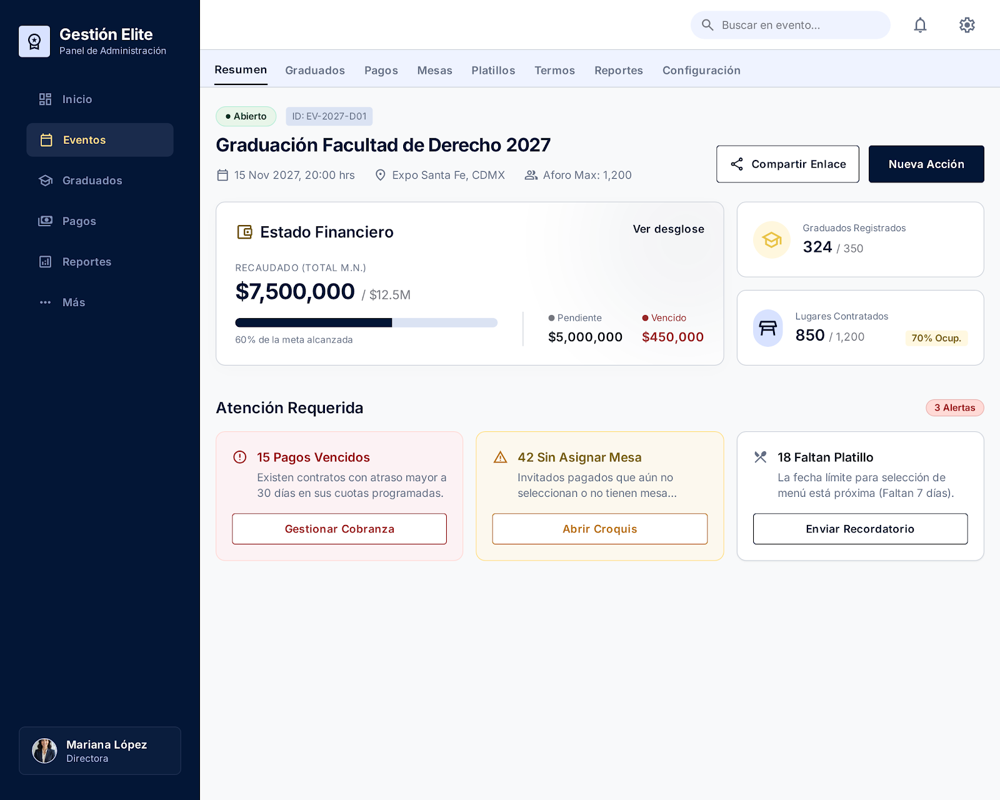
    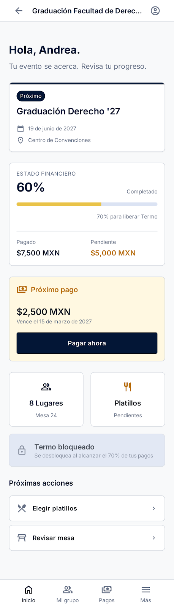
  

<!-- Fuentes UI: frontend/src/App.tsx; stitch_gr_prototype/.../evento_resumen_general/screen.png; stitch_gr_prototype/.../inicio_estado_normal_c1_corregido/screen.png -->

---

<!-- _class: overview -->
<!-- _data-flow: VISIÓN DE PRODUCTO -->

## Dos experiencias. Una sola operación.

  

    <h3>Graduado · mobile first</h3>
    
Claridad, autonomía y una próxima acción evidente.

    

      Acceso y contrato
      Grupo y beneficios
      Pagos y evento
    

    
  

  

    <h3>Administración · desktop first</h3>
    
Visibilidad, intervención y trazabilidad por evento.

    

      Crear y configurar
      Operar y cobrar
      Medir y auditar
    

    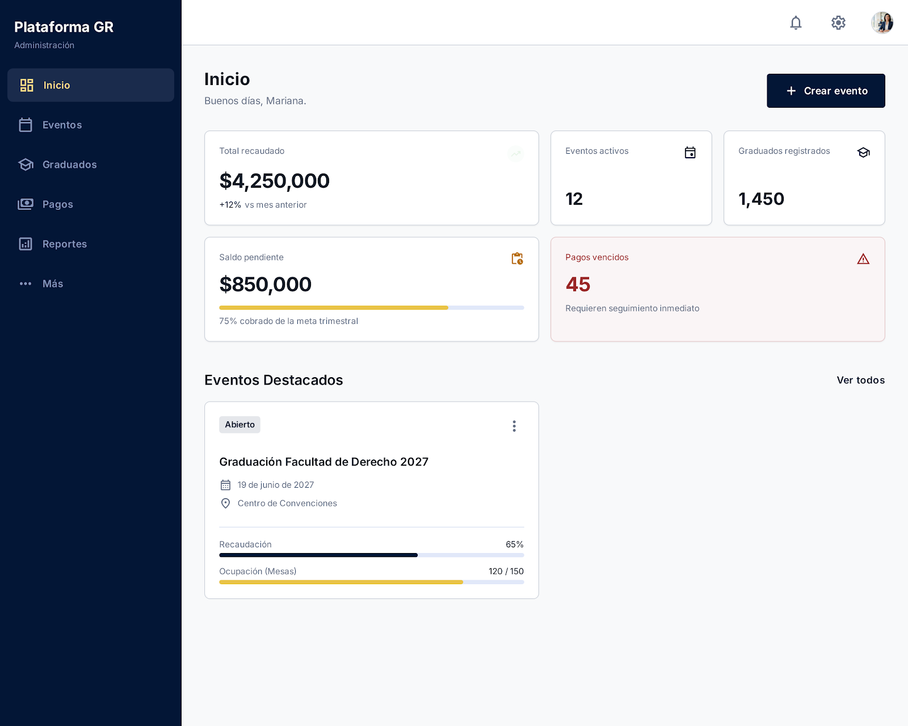
  

<!-- Fuente funcional: docs/UX_FLOWS.md §§2–3 y 36; rutas: /graduate/* y /admin/* -->

---

<!-- _data-flow: GRADUADO · 01 -->

  

    
Entrada contextual

    <h2>El evento correcto desde el primer contacto</h2>
    
El código conecta al graduado con su experiencia, sin navegación ambigua.

    

      
Acceso por evento

      
Una acción dominante

      
Continuidad a cuenta

    

  

  
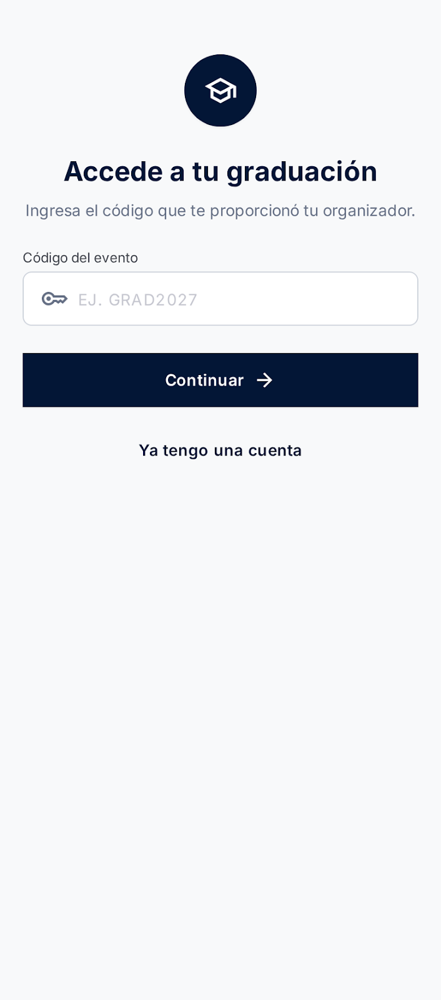

<!-- Ruta UI: /access · Componente: GraduateAccessScreen.tsx · Flujo: UX-G-AUTH-001 -->

---

<!-- _data-flow: GRADUADO · 02 -->

  

    
Inicio personal

    <h2>El graduado entiende qué sigue en segundos</h2>
    
Evento, avance financiero, próximo pago y pendientes operativos conviven en una sola vista.

    

      
Progreso financiero

      
Próximo pago visible

      
Pendientes accionables

    

  

  

<!-- Ruta UI: /graduate · Componente: GraduateHomeScreen.tsx · Flujo: UX-G-HOME -->

---

<!-- _data-flow: GRADUADO · 03 -->

  

    
Mi grupo

    <h2>Todos los lugares, personas y pendientes bajo control</h2>
    
La experiencia muestra capacidad contratada, integrantes y avance nominal sin complejidad operativa.

    

      
Capacidad utilizada

      
Integrantes nominales

      
Estado por persona

    

  

  
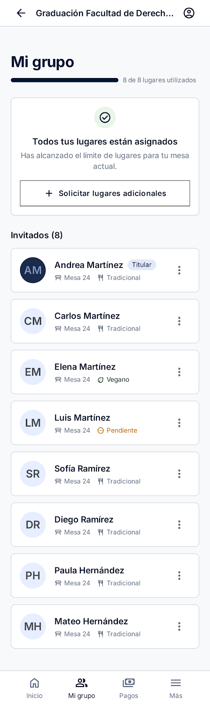

<!-- Ruta UI: /graduate/group · Componente: GraduateGroupScreen.tsx · Flujo: UX-G-GROUP -->

---

<!-- _data-flow: GRADUADO · 04 -->

  

    
Mis pagos

    <h2>La cobranza se convierte en una experiencia clara</h2>
    
Cada obligación tiene contexto, fecha, monto y una siguiente acción segura.

    

      
Avance consolidado

      
Calendario por cuota

      
Beneficio desbloqueado

    

  

  
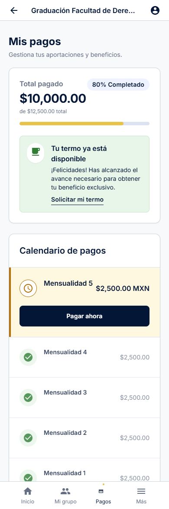

<!-- Ruta UI: /graduate/payments · Componente: GraduatePaymentsScreen.tsx · Flujo: UX-G-PAY -->

---

<!-- _data-flow: GRADUADO · 05 -->

  

    
Selección de mesa

    <h2>Elegir ubicación se vuelve visual y confiable</h2>
    
Disponibilidad, ocupación y selección propia se comunican sin exponer datos de terceros.

    

      
Mapa de disponibilidad

      
Estados inequívocos

      
Mesa propia destacada

    

  

  
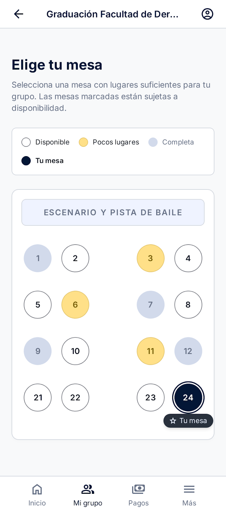

<!-- Ruta UI: /graduate/table · Componente: GraduateTableScreen.tsx · Flujo: UX-G-SEAT -->

---

<!-- _data-flow: GRADUADO · 06 -->

  

    
Platillos

    <h2>La captura termina con un resumen verificable</h2>
    
Cada integrante conserva su selección y el grupo confirma con una vista consolidada.

    

      
Selección individual

      
Preferencias visibles

      
Resumen de producción

    

  

  
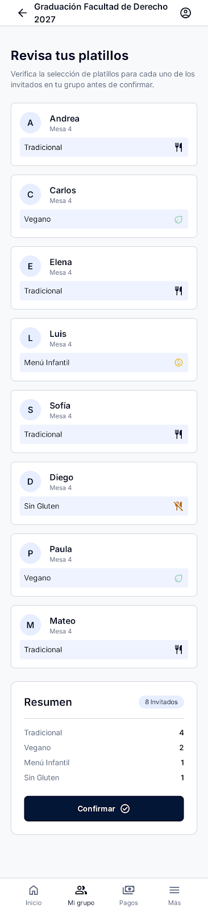

<!-- Ruta UI: /graduate/meals · Componente: GraduateMealsScreen.tsx · Flujo: UX-G-MEAL -->

---

<!-- _data-flow: GRADUADO · 07 -->

  

    
Beneficio premium

    <h2>El avance financiero activa una recompensa tangible</h2>
    
El termo pasa de bloqueado a disponible, solicitado, producción y entrega.

    

      
Disponibilidad automática

      
Personalización controlada

      
Solicitud trazable

    

  

  
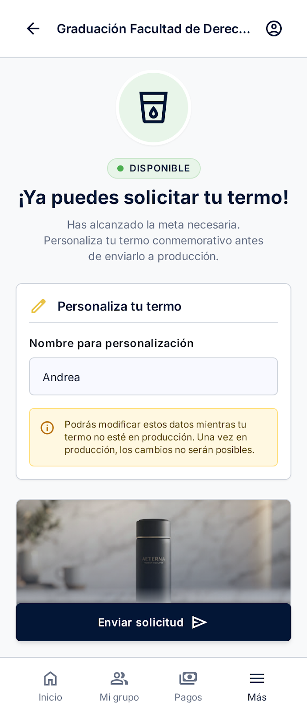

<!-- Ruta UI: /graduate/thermo · Componente: GraduateThermoScreen.tsx · Flujo: UX-G-TH -->

---

<!-- _data-flow: ADMIN · 01 -->

  
Acceso administrativo

  <h2>Una entrada sobria para una operación reservada</h2>
  
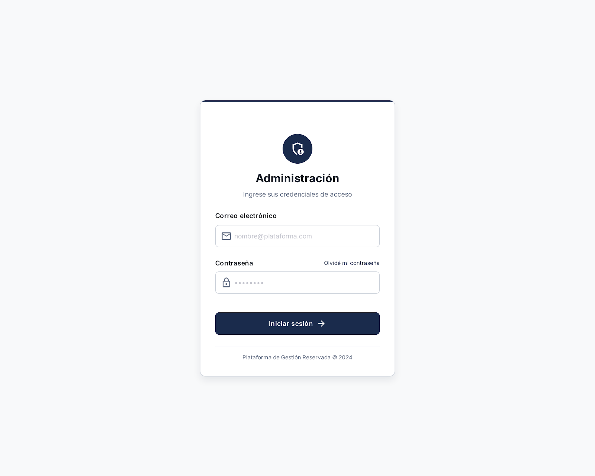

  

    
Identidad separada

    
Recuperación segura

    
Acceso directo al control

  

<!-- Ruta UI: /admin/login · Componente: AdminLoginScreen.tsx -->

---

<!-- _data-flow: ADMIN · 02 -->

  
Dashboard global

  <h2>El negocio ve escala, cobranza y riesgo en una mirada</h2>
  

  

    
Recaudación consolidada

    
Alertas de vencimiento

    
Eventos destacados

  

<!-- Ruta UI: /admin · Componente: AdminDashboardScreen.tsx · Flujo: ADMIN Dashboard -->

---

<!-- _data-flow: ADMIN · 03 -->

  
Portafolio de eventos

  <h2>Cada evento conserva estado, escala y avance financiero</h2>
  
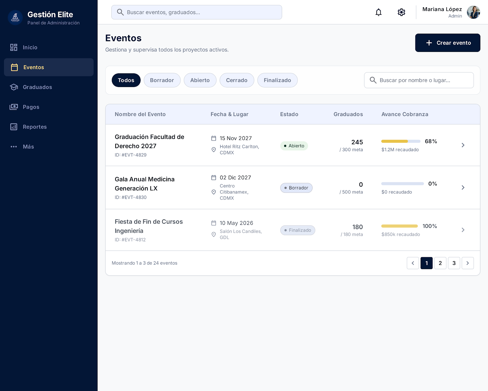

  

    
Ciclo de vida visible

    
Meta y ocupación

    
Entrada a detalle

  

<!-- Ruta UI: /admin/events · Componente: AdminEventsScreen.tsx -->

---

<!-- _data-flow: ADMIN · 04 -->

  
Creación guiada

  <h2>Configurar un evento termina en una revisión ejecutiva</h2>
  
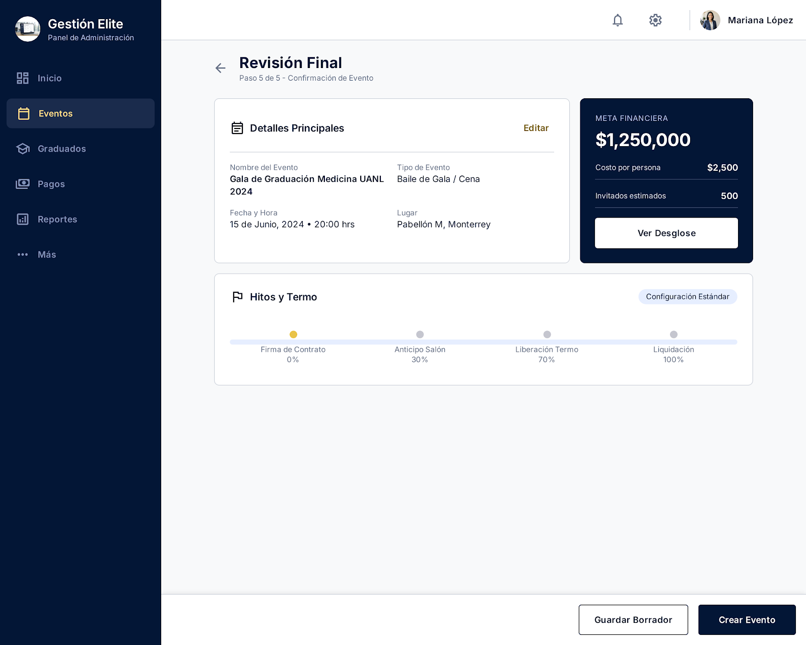

  

    
Datos principales

    
Plan financiero

    
Hitos operativos

  

<!-- Ruta UI: /admin/events/new · Componente: CreateEventWizardScreen.tsx · Wizard real con 9 pasos en docs/UX_FLOWS.md -->

---

<!-- _data-flow: ADMIN · 05 -->

  
Centro de control

  <h2>El evento concentra finanzas, capacidad y alertas accionables</h2>
  

  

    
Estado financiero

    
Capacidad contratada

    
Atención requerida

  

<!-- Ruta UI: /admin/events/:eventId · Componente: AdminEventOverviewScreen.tsx -->

---

<!-- _data-flow: ADMIN · 06 -->

  
Cartera de graduados

  <h2>Los filtros convierten excepciones en prioridades operativas</h2>
  
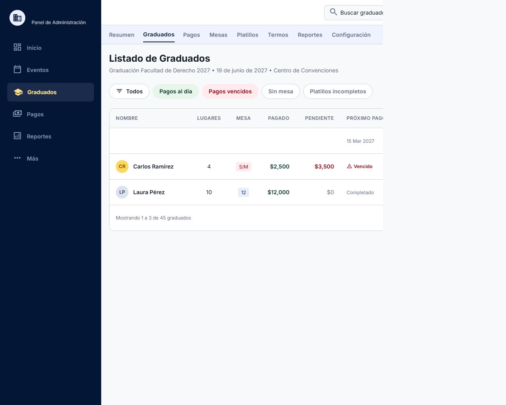

  

    
Estado financiero

    
Asignación de mesa

    
Pendientes de platillo

  

<!-- Ruta UI: /admin/events/:eventId/graduates · Componente: AdminEventGraduatesListScreen.tsx -->

---

<!-- _data-flow: ADMIN · 07 -->

  
Expediente 360°

  <h2>Una persona, todo su contexto contractual y operativo</h2>
  
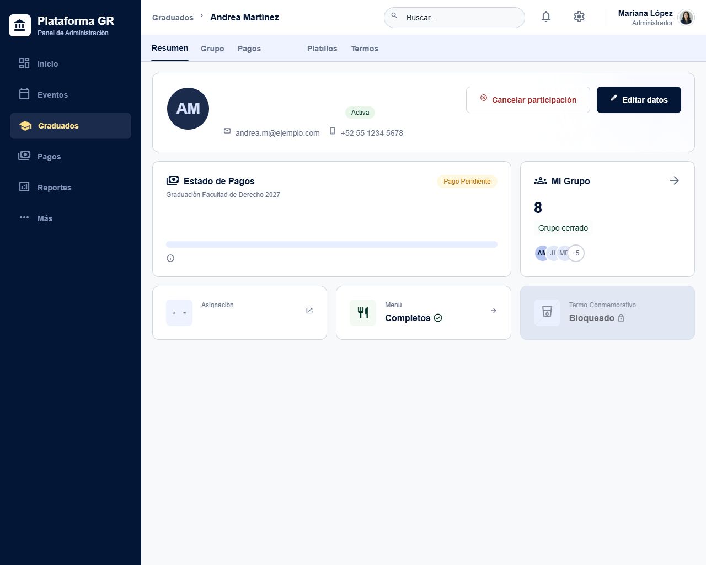

  

    
Estado de pagos

    
Grupo y asignación

    
Platillos y termo

  

<!-- Ruta UI: /admin/events/:eventId/graduates/:graduateId · Componente: AdminGraduateOverviewScreen.tsx -->

---

<!-- _data-flow: ADMIN · 08 -->

  
Control financiero

  <h2>La cartera revela cuánto, cuándo y dónde intervenir</h2>
  
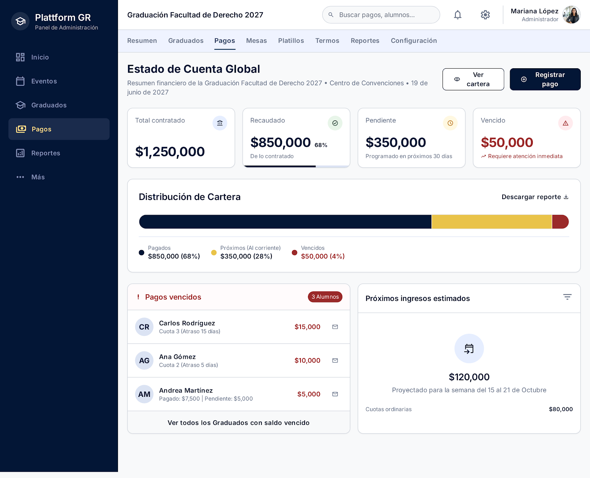

  

    
Contratado vs. cobrado

    
Vencido destacado

    
Próximos ingresos

  

<!-- Ruta UI: /admin/events/:eventId/payments · Componente: AdminEventPaymentsScreen.tsx -->

---

<!-- _data-flow: ADMIN · 09 -->

  
Croquis y mesas

  <h2>La capacidad deja de ser una hoja de cálculo</h2>
  
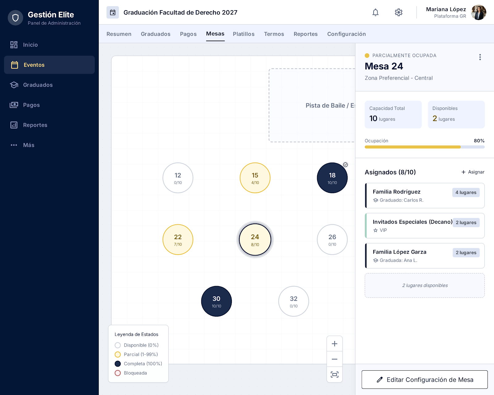

  

    
Ocupación sobre el plano

    
Detalle de asignados

    
Capacidad disponible

  

<!-- Ruta UI: /admin/events/:eventId/tables · Componente: AdminEventTablesScreen.tsx -->

---

<!-- _data-flow: ADMIN · 10 -->

## Producción de alimentos y beneficios, en tiempo real

  

    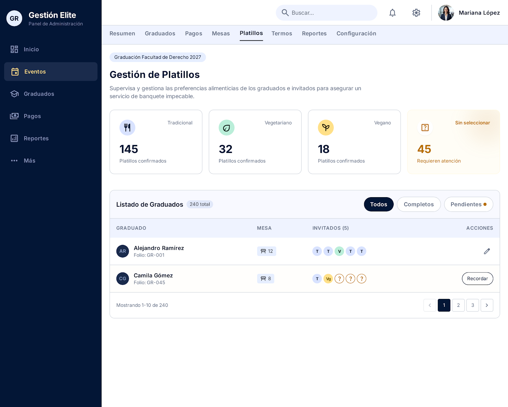
    
 Platillos · totales, pendientes y detalle

  

  

    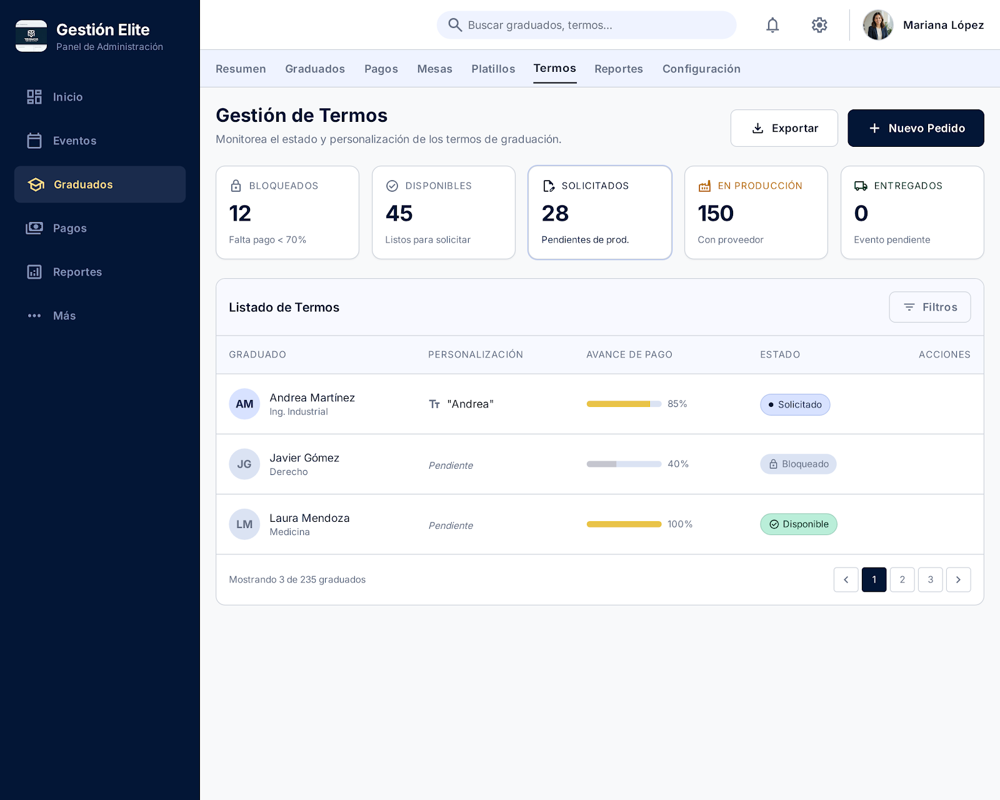
    
 Termos · estados, producción y entrega

  

<!-- Rutas UI: /admin/events/:eventId/meals y /thermos · Componentes: AdminEventMealsScreen.tsx, AdminEventThermosScreen.tsx -->

---

<!-- _data-flow: ADMIN · 11 -->

## Medición ejecutiva y trazabilidad operativa

  

    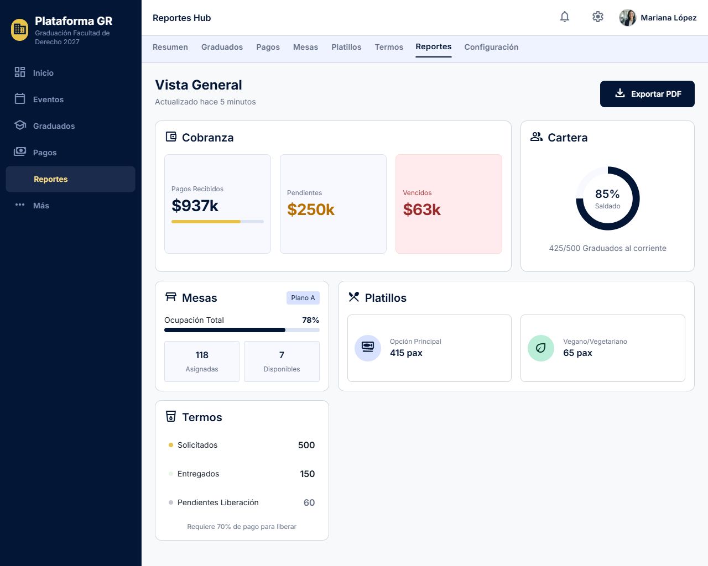
    
 Reportes · finanzas, cartera y operación

  

  

    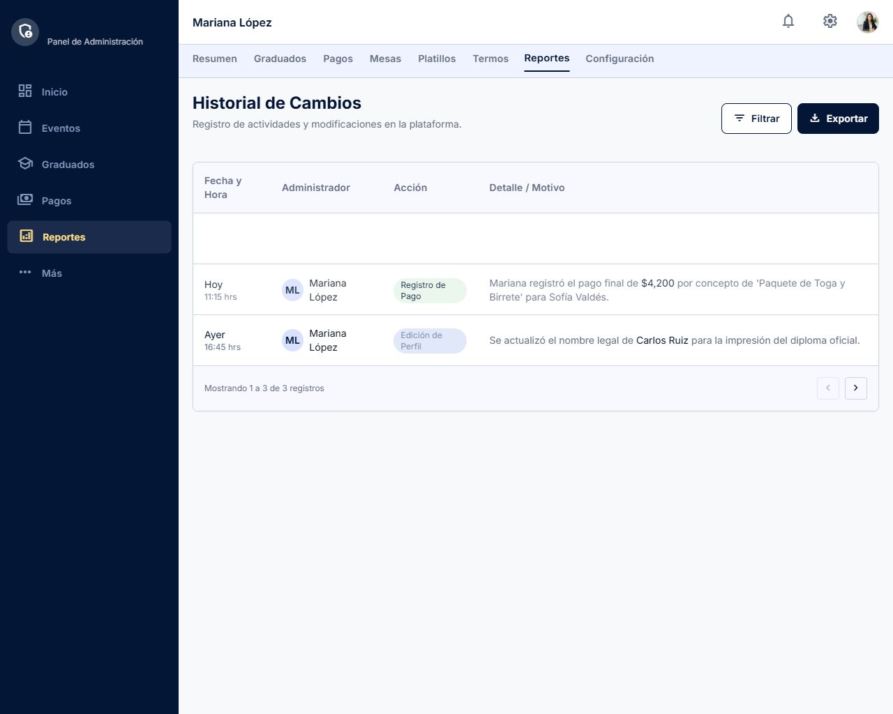
    
 Auditoría · quién cambió qué y cuándo

  

<!-- Rutas UI: /admin/events/:eventId/reports y /audit · Componentes: AdminEventReportsScreen.tsx, AdminEventAuditScreen.tsx -->

---

<!-- _class: close -->

  

    
RESULTADO

    <h2>Una experiencia que conecta servicio, operación y control</h2>
    
El graduado avanza con confianza. La administración actúa con información. El negocio conserva trazabilidad.

    
Una sola fuente operativa

  

  

<!-- Cierre basado en docs/PRODUCT_SCOPE.md §3 y UI real versionada. -->
