# Plataforma GR — Máquinas de Estado del Dominio

**Documento:** `STATE_MACHINES.md`  
**Versión:** 1.0  
**Fecha:** 8 de septiembre de 2026  
**Estado:** BASELINE NORMATIVO APROBADO  
**Documentos Padre:** `BUSINESS_RULES.md`, `DOMAIN_MODEL.md`, `DATA_MODEL.md`, `API_CONTRACT.openapi.yaml`, `AUTHORIZATION_MATRIX.md`

---

## 1. Principios Fundamentales y Clasificación de Estados

En **Plataforma GR**, todo estado del sistema pertenece estrictamente a una de las siguientes tres categorías:

### 1.1 Estado Persistido (Authoritative State)
Es el estado almacenado explícitamente en una columna de tipo `ENUM` en PostgreSQL. Representa un hecho contractual, operativo o administrativo formalmente registrado.
- Toda mutación de estado persistido debe estar validada por un **Domain Transition Guard**.
- Ningún controller puede realizar mutaciones arbitrarias en base de datos (`prisma.update({ data: { status } })`) sin pasar por la validación de dominio.
- El reloj del servidor y el contexto de autenticación (`ActorContext`) son obligatorios para toda transición.

### 1.2 Estado Derivado (Projected State / Query-time)
Es un estado calculado dinámicamente en tiempo de consulta combinando hechos persistidos inmutables (montos, allocations, deadlines, capacidades).
- **PROHIBIDO:** Los estados derivados **NUNCA** se persisten en base de datos como autoridad ni poseen columnas dedicadas de tipo estado.
- Intentar persistir un estado derivado constituye una violación crítica de consistencia.

#### Catálogo de Estados Derivados Canónicos:
1. **`Installment` (`PAID`, `OVERDUE`, `PARTIALLY_PAID`, `PENDING`):**
   - Se deriva comparando:
     - `paid_amount = sum(PaymentAllocation.amount)`
     - `unpaid_amount = Installment.amount - paid_amount`
     - Si `unpaid_amount <= 0` => **PAID**
     - Si `unpaid_amount > 0` y `now() > (due_date + grace_days)` => **OVERDUE**
     - Si `unpaid_amount > 0` y `paid_amount > 0` => **PARTIALLY_PAID**
     - Si `paid_amount == 0` y `now() <= (due_date + grace_days)` => **PENDING**
   - En base de datos, `Installment` únicamente persiste `status: InstallmentLifecycleStatus (ACTIVE | CANCELLED)`.
2. **`EventTable` (`FULL`, `PARTIAL`, `EMPTY`):**
   - Se deriva comparando `capacity` de la mesa con el recuento de `TableAssignment` activos:
     - `assigned_count = count(TableAssignment)`
     - Si `assigned_count >= table.capacity` => **FULL**
     - Si `0 < assigned_count < table.capacity` => **PARTIAL**
     - Si `assigned_count == 0` => **EMPTY**
   - En base de datos, `EventTable` únicamente persiste `status: TableStatus (AVAILABLE | BLOCKED)`.
3. **`ThermoRequest` (`LOCKED`, `AVAILABLE`):**
   - Se deriva comparando el avance financiero de la membresía con el umbral del evento (`thermo_threshold_percent`):
     - `financial_progress = net_eligible_paid / contracted_total`
     - Si `financial_progress < thermo_threshold_percent` => **LOCKED**
     - Si `financial_progress >= thermo_threshold_percent` => **AVAILABLE**
   - En base de datos, `ThermoRequest` únicamente persiste estados operativos post-solicitud: `REQUESTED`, `IN_PRODUCTION`, `DELIVERED`.

### 1.3 Estado UI Efímero (Client-only / Transient)
Estados de interacción puramente visuales en el frontend (ej. `SUBMITTING`, `HOVERED`, `MODAL_OPEN`, `VALIDATING_OCR`). No tienen representación en backend y no rigen reglas de consistencia de negocio.

---

## 2. Invariantes Críticos Globales de Transición

1. **Invariante de Pago Electrónico (BR-PAY-004 / BR-PAY-005):**
   - El frontend return URL (`/payment/return`) **NUNCA** produce el estado `CONFIRMED` en un `PaymentAttempt`.
   - `CONFIRMED` solo es emitido por verificación criptográficamente autenticada de webhook de proveedor (Mercado Pago / OpenPay) o polling s2s directo del backend.
2. **Invariante de Comprobante Manual (BR-PROOF-005 / BR-PROOF-007):**
   - La transición a `APPROVED` en un `PaymentSubmission` produce atómicamente **a lo más una** `PaymentTransaction`.
   - La repetición idempotente de la aprobación retorna el estado procesado sin duplicar transacciones ni allocations.
3. **Invariante de Reembolso e Historial Contable (BR-FIN-007 / BR-REF-001 / BR-ADJ-001):**
   - Un `Refund` **NUNCA** elimina, sobreescribe ni reduce la `PaymentTransaction` original. El ledger contable es append-only.
   - El reembolso se registra como un movimiento compensatorio independiente con su propio identificador y trazabilidad.
   - La suma acumulada de reembolsos confirmados no puede exceder el importe neto efectivamente pagado y reembolsable.
4. **Invariante de Inmutabilidad Contractual (BR-CONTRACT-005 / BR-CANPOL-007):**
   - Un contrato en estado `ACCEPTED` es inmutable; conserva un snapshot y hash criptográfico de los términos aplicables. No admite edición en sitio.
   - Modificaciones contractuales requieren adendas formales (`ContractLineItemQuote`) o superación explícita (`SUPERSEDED`).
   - Políticas de cancelación en estado `ACTIVE` son inmutables; cualquier cambio genera una nueva versión.

---

## 3. Catálogo Detallado de Máquinas de Estado

---

### 3.1 Event (`EventStatus`)

Gobierna el ciclo de vida del evento institucional. Todo recurso operativo deriva su validez del evento al que pertenece.

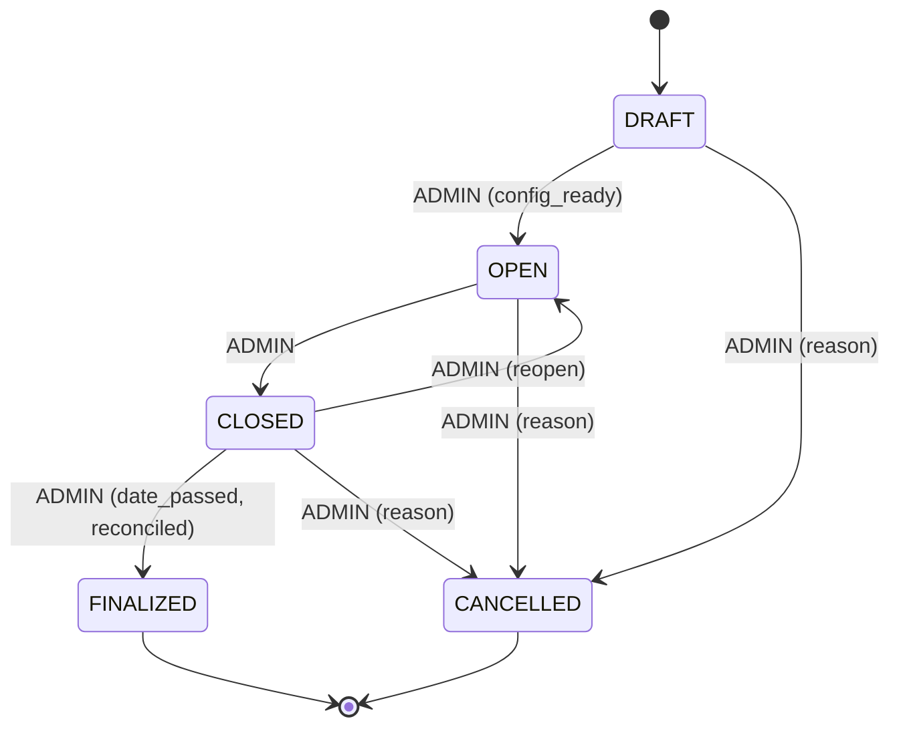

#### Estados:
- `DRAFT`: Configuración inicial. No acepta registros ni pagos reales de graduados.
- `OPEN`: Operación ordinaria. Graduados pueden interactuar conforme a fechas límite.
- `CLOSED`: Bloqueo operativo para graduados. No permite nuevas altas, selección de platillos ni asignación de mesas. ADMIN puede reabrirlo o finalizarlo.
- `FINALIZED` *(Terminal)*: Evento concluido. Histórico protegido.
- `CANCELLED` *(Terminal)*: Operación cancelada. Conserva datos sin eliminarlos.

#### Matriz de Transiciones Válidas:

| Estado Origen | Comando / Acción | Estado Destino | Actor | Precondiciones e Invariantes | Efectos Colaterales (Side-effects) |
|---|---|---|---|---|---|
| `DRAFT` | `OPEN_EVENT` | `OPEN` | `ADMIN` | Configuración financiera activa y al menos 1 producto base creado. Capacidad > 0. | Habilita códigos de acceso contextuales para registro. |
| `DRAFT` | `CANCEL_EVENT` | `CANCELLED` | `ADMIN` | Requiere motivo (`reason`). | Registra auditoría. Bloquea futuras operaciones. |
| `OPEN` | `CLOSE_EVENT` | `CLOSED` | `ADMIN` | Ninguna. | Bloquea mutaciones de graduados; mantiene accesos de consulta. |
| `OPEN` | `CANCEL_EVENT` | `CANCELLED` | `ADMIN` | Requiere motivo (`reason`). | Cancela membresías activas sin borrar historial contable. |
| `CLOSED` | `REOPEN_EVENT` | `OPEN` | `ADMIN` | Fecha del evento no ha expirado. | Restablece capacidad operativa ordinaria. |
| `CLOSED` | `FINALIZE_EVENT` | `FINALIZED` | `ADMIN` | Fecha del evento ya transcurrió (`now() >= event.date`). | Congela estado final; emite evento de finalización. |
| `CLOSED` | `CANCEL_EVENT` | `CANCELLED` | `ADMIN` | Requiere motivo (`reason`). | Desactiva mesas y accesos. |

#### Transiciones Prohibidas:
- `FINALIZED -> *` (Terminal estricto. Prohibido reabrir o cancelar).
- `CANCELLED -> *` (Terminal estricto. Prohibido reabrir).
- `DRAFT -> CLOSED` o `DRAFT -> FINALIZED` (Salto ilegal de ciclo de vida).
- Cualquier transición iniciada por rol `GRADUATE`.

---

### 3.2 GraduateMembership (`GraduateMembershipStatus`)

Representa la participación de una cuenta en un evento específico.

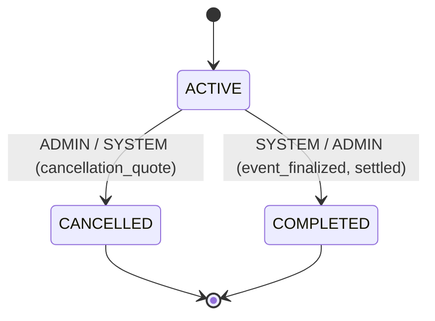

#### Estados:
- `ACTIVE`: Participación vigente con acceso a compras, mesas y platillos.
- `CANCELLED` *(Terminal)*: Membresía cancelada. Desvincula mesas y platillos.
- `COMPLETED` *(Terminal)*: Participación concluida exitosamente tras el evento.

#### Matriz de Transiciones Válidas:

| Estado Origen | Comando / Acción | Estado Destino | Actor | Precondiciones e Invariantes | Efectos Colaterales |
|---|---|---|---|---|
| `ACTIVE` | `CANCEL_MEMBERSHIP` | `CANCELLED` | `ADMIN`, `SYSTEM` | Debe contar con cotización de cancelación o causal de mora reglamentada. Motivo obligatorio. | Libera asignaciones de mesa (`TableAssignment`), cancela obligaciones futuras, registra nota interna y auditoría. |
| `ACTIVE` | `COMPLETE_MEMBERSHIP` | `COMPLETED` | `ADMIN`, `SYSTEM` | El evento está en `FINALIZED` y el plan de pagos liquidado (`SETTLED`). | Cierra expediente del graduado para este evento. |

#### Transiciones Prohibidas:
- `CANCELLED -> *` (Terminal. No admite reactivación directa; requiere alta de nueva membresía si aplica).
- `COMPLETED -> *` (Terminal).
- `GRADUATE` intentando cancelar directamente sin pasar por confirmación de `ADMIN`.

---

### 3.3 GraduateContract (`ContractStatus`)

Gobierna el contrato individual de prestación de servicios y sus adendas.

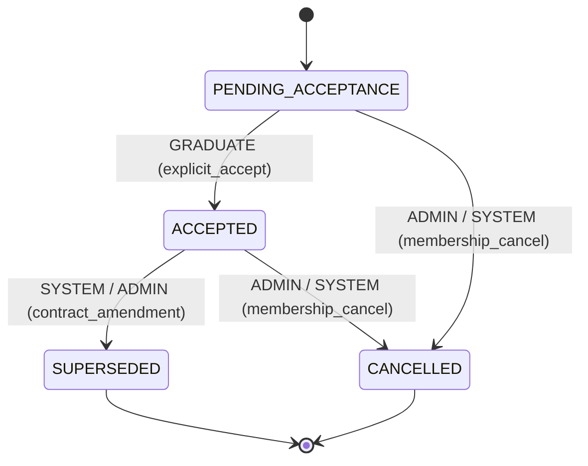

#### Estados:
- `PENDING_ACCEPTANCE`: Emitido con folio único; en espera de firma digital del graduado.
- `ACCEPTED`: Aceptado formalmente. Inmutable. Snapshot y hash fijados.
- `SUPERSEDED` *(Terminal)*: Reemplazado por una nueva versión contractual o adenda formal.
- `CANCELLED` *(Terminal)*: Cancelado administrativamente junto con la membresía.

#### Matriz de Transiciones Válidas:

| Estado Origen | Comando / Acción | Estado Destino | Actor | Precondiciones e Invariantes | Efectos Colaterales |
|---|---|---|---|---|
| `PENDING_ACCEPTANCE` | `ACCEPT_CONTRACT` | `ACCEPTED` | `GRADUATE` | Requiere aceptación explícita de términos vigentes, hash de snapshot y captura de IP. | Registra timestamp, IP hash y log de auditoría. Idempotente (re-aceptar retorna éxito). |
| `PENDING_ACCEPTANCE` | `CANCEL_CONTRACT` | `CANCELLED` | `ADMIN`, `SYSTEM` | Cancelación de membresía antes de la aceptación. | Invalida folio para operaciones futuras. |
| `ACCEPTED` | `SUPERSEDE_CONTRACT` | `SUPERSEDED` | `ADMIN`, `SYSTEM` | Generación de nuevo contrato versión N+1 por cambio sustantivo de términos. | Conserva el histórico inalterable como referencia legal. |
| `ACCEPTED` | `CANCEL_CONTRACT` | `CANCELLED` | `ADMIN`, `SYSTEM` | Membresía cancelada. Motivo obligatorio. | Desactiva derechos contractuales; fija penalizaciones. |

#### Transiciones Prohibidas:
- `SUPERSEDED -> *` (Terminal).
- `CANCELLED -> *` (Terminal).
- `ACCEPTED -> PENDING_ACCEPTANCE` (No se puede "des-firmar" un contrato).
- Modificación del contenido o hash de un contrato en `ACCEPTED`.

---

### 3.4 ContractLineItemQuote (`ContractLineItemQuoteStatus`)

Gobierna las cotizaciones de adición de lugares, boletos adicionales o catch-up financiero.

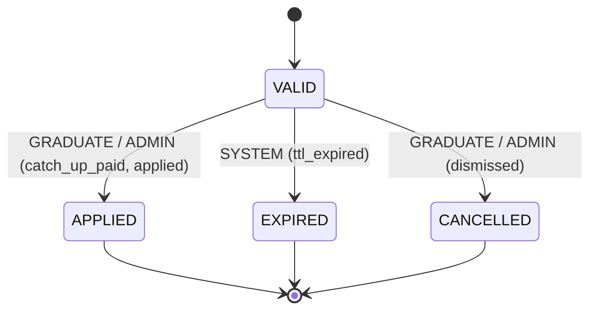

#### Estados:
- `VALID`: Cotización vigente con importes de productos y catch-up congelados temporalmente.
- `APPLIED` (Persistido como `USED`): Aplicada formalmente al contrato y plan de pagos.
- `EXPIRED` *(Terminal)*: TTL vencido sin haber sido confirmada.
- `CANCELLED` *(Terminal)*: Descartada por el usuario o administrador.

#### Matriz de Transiciones Válidas:

| Estado Origen | Comando / Acción | Estado Destino | Actor | Precondiciones e Invariantes | Efectos Colaterales |
|---|---|---|---|---|
| `VALID` | `APPLY_QUOTE` | `APPLIED` / `USED` | `GRADUATE`, `ADMIN` | Capacidad de evento disponible revalidada con lock. Catch-up cubierto si aplica. | Crea `ContractLineItem` en el contrato, recalcula plan financiero y emite auditoría. |
| `VALID` | `EXPIRE_QUOTE` | `EXPIRED` | `SYSTEM` | `now() > expires_at`. | Invalida precios y montos cotizados. |
| `VALID` | `CANCEL_QUOTE` | `CANCELLED` | `GRADUATE`, `ADMIN` | Cotización no ha sido aplicada. | Descarta la intención de compra. |

#### Transiciones Prohibidas:
- `APPLIED / USED -> *` (Terminal).
- `EXPIRED -> *` (Terminal; requiere emitir nueva cotización con precios actuales).
- `CANCELLED -> *` (Terminal).

---

### 3.5 PaymentPlan (`PaymentPlanStatus`)

Gobierna las obligaciones financieras globales de la membresía.

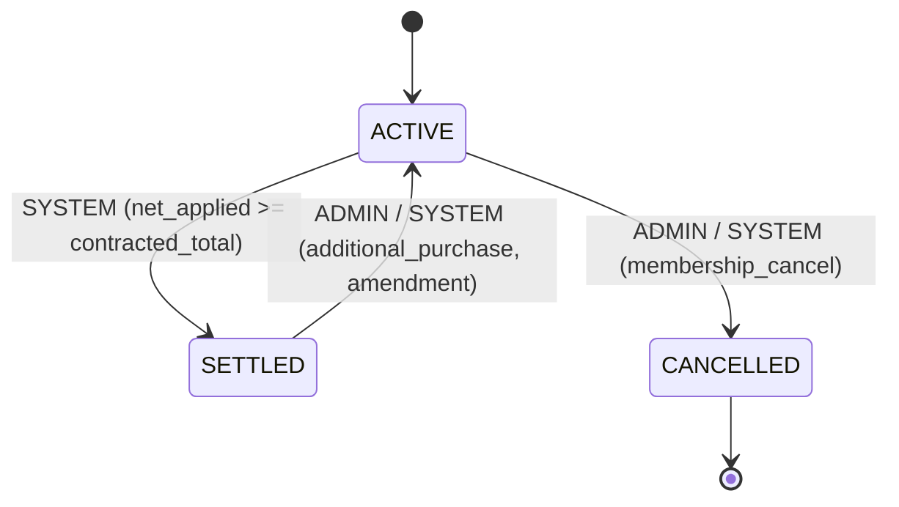

#### Estados:
- `ACTIVE`: Plan con saldo exigible o en calendario regular de pagos.
- `SETTLED` (Canónico: `COMPLETED`): Saldo total liquidado (`net_applied >= contracted_total`).
- `CANCELLED` *(Terminal)*: Plan cancelado junto con la membresía.

#### Matriz de Transiciones Válidas:

| Estado Origen | Comando / Acción | Estado Destino | Actor | Precondiciones e Invariantes | Efectos Colaterales |
|---|---|---|---|---|
| `ACTIVE` | `SETTLE_PLAN` | `SETTLED` (COMPLETED) | `SYSTEM`, `ADMIN` | Monto neto aplicado igual o mayor al total contratado. | Desbloquea liberaciones de fin de ciclo si aplican. |
| `ACTIVE` | `CANCEL_PLAN` | `CANCELLED` | `ADMIN`, `SYSTEM` | Membresía cancelada. | Cancela cuotas futuras pendientes (`InstallmentLifecycleStatus = CANCELLED`). |
| `SETTLED` | `REOPEN_PLAN` | `ACTIVE` | `ADMIN`, `SYSTEM` | Incremento de lugares o adición de productos contratados posteriores a la liquidación. | Genera nuevas cuotas o adendas de pago exigibles. |

#### Transiciones Prohibidas:
- `CANCELLED -> *` (Terminal estricto).
- Transición a `SETTLED` existiendo saldo insoluto real en el ledger.

---

### 3.6 PaymentAttempt (`PaymentAttemptStatus`)

Gobierna los intentos de cobro a través de pasarelas electrónicas (Mercado Pago / OpenPay).

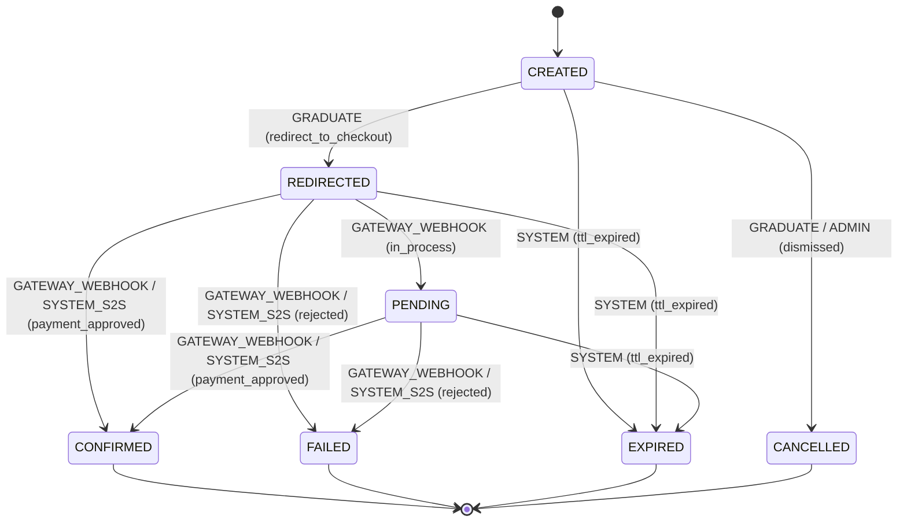

#### Estados:
- `CREATED`: Intento inicializado con preferencia de pago y `checkout_url`.
- `REDIRECTED`: El graduado fue redirigido a la pasarela.
- `PENDING`: La pasarela reporta el cobro en proceso (ej. pago en efectivo OXXO pendiente).
- `CONFIRMED` *(Terminal)*: Pago aprobado y verificado server-to-server.
- `FAILED` *(Terminal)*: Transacción rechazada por el banco/pasarela.
- `EXPIRED` *(Terminal)*: Tiempo límite de pago agotado sin confirmación.
- `CANCELLED` *(Terminal)*: Cancelado antes de confirmarse.

#### Matriz de Transiciones Válidas:

| Estado Origen | Comando / Acción | Estado Destino | Actor | Precondiciones e Invariantes | Efectos Colaterales |
|---|---|---|---|---|
| `CREATED` | `REDIRECT_ATTEMPT` | `REDIRECTED` | `GRADUATE` | La preferencia existe y no ha expirado. | Actualiza estado a la espera de resolución de la pasarela. |
| `CREATED` | `CANCEL_ATTEMPT` | `CANCELLED` | `GRADUATE`, `ADMIN` | No ha sido enviado a la pasarela ni procesado. | Cierra el intento. |
| `CREATED` | `EXPIRE_ATTEMPT` | `EXPIRED` | `SYSTEM` | `now() > expires_at`. | Invalida el checkout URL. |
| `REDIRECTED` | `MARK_PENDING` | `PENDING` | `GATEWAY_WEBHOOK`, `SYSTEM` | Notificación formal de pasarela indicando estado pendiente. | Registra referencia externa de la pasarela. |
| `REDIRECTED` | `CONFIRM_ATTEMPT` | `CONFIRMED` | `GATEWAY_WEBHOOK`, `SYSTEM` | Verificación server-to-server válida con firma criptográfica. **PROHIBIDO return URL**. | Crea `PaymentTransaction`, ejecuta algoritmo waterfall de `PaymentAllocation`, audita. |
| `REDIRECTED` | `FAIL_ATTEMPT` | `FAILED` | `GATEWAY_WEBHOOK`, `SYSTEM` | Notificación formal de rechazo de pago. | Registra motivo de fallo de pasarela. |
| `REDIRECTED` | `EXPIRE_ATTEMPT` | `EXPIRED` | `SYSTEM` | TTL vencido sin confirmación. | Cierra el intento por timeout. |
| `PENDING` | `CONFIRM_ATTEMPT` | `CONFIRMED` | `GATEWAY_WEBHOOK`, `SYSTEM` | Confirmación definitiva recibida de la pasarela. | Crea `PaymentTransaction` y aplica allocations. |
| `PENDING` | `FAIL_ATTEMPT` | `FAILED` | `GATEWAY_WEBHOOK`, `SYSTEM` | Notificación de fallo definitiva recibida de la pasarela. | Registra fallo. |
| `PENDING` | `EXPIRE_ATTEMPT` | `EXPIRED` | `SYSTEM` | TTL vencido. | Cierra el intento por timeout. |

#### Regla Inquebrantable de Pasarela:
> **BR-PAY-004:** El frontend return URL (`/payment/return`) **NUNCA** cambia el estado de `PaymentAttempt` a `CONFIRMED`. Si el cliente regresa, solo puede consultar el estado vía API o permanecer en `REDIRECTED` hasta que el webhook procese el pago con lock de base de datos.

#### Transiciones Prohibidas:
- `CONFIRMED -> *` (Terminal estricto. El dinero confirmado es inmutable).
- `FAILED -> *` (Terminal estricto).
- `EXPIRED -> *` (Terminal estricto).
- `CANCELLED -> *` (Terminal estricto).
- Transición directa `CREATED -> CONFIRMED` por llamada de cliente sin verificación de pasarela.

---

### 3.7 PaymentSubmission (`PaymentSubmissionStatus`)

Gobierna los comprobantes manuales de transferencia o depósito reportados por los graduados.

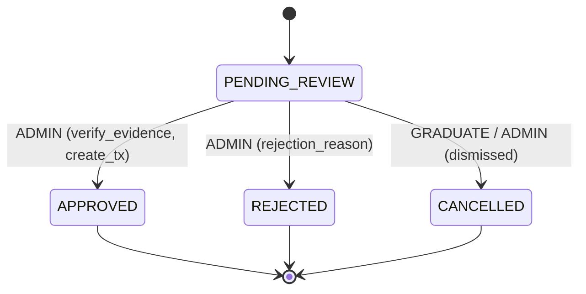

#### Estados:
- `PENDING_REVIEW`: Comprobante subido por graduado con archivo adjunto (`FileAsset`). No representa dinero confirmado.
- `APPROVED` *(Terminal)*: Revisado y aprobado por administrador.
- `REJECTED` *(Terminal)*: Rechazado por administrador por ser ilegible, inválido o duplicado.
- `CANCELLED` *(Terminal)*: Cancelado por el graduado antes de su revisión.

#### Matriz de Transiciones Válidas:

| Estado Origen | Comando / Acción | Estado Destino | Actor | Precondiciones e Invariantes | Efectos Colaterales |
|---|---|---|---|---|
| `PENDING_REVIEW` | `APPROVE_SUBMISSION` | `APPROVED` | `ADMIN` | Archivo verificado. Transacción atómica en DB. Idempotente. | Crea **exactamente una** `PaymentTransaction` confirmada, aplica waterfall de allocations, asocia `reviewed_by_account_id` y `reviewed_at`. |
| `PENDING_REVIEW` | `REJECT_SUBMISSION` | `REJECTED` | `ADMIN` | Motivo de rechazo (`rejection_reason`) obligatorio y no vacío. | Registra motivo, fecha y autor del rechazo. No crea transacciones ni allocations. |
| `PENDING_REVIEW` | `CANCEL_SUBMISSION` | `CANCELLED` | `GRADUATE`, `ADMIN` | El comprobante se encuentra en `PENDING_REVIEW`. | Cancela la solicitud de validación. |

#### Transiciones Prohibidas:
- `APPROVED -> *` (Terminal. Inmutable; no se puede rechazar un comprobante ya aprobado).
- `REJECTED -> *` (Terminal; el usuario debe emitir un nuevo comprobante corregido).
- `CANCELLED -> *` (Terminal).
- Aprobación o rechazo ejecutado por rol `GRADUATE`.
- Aprobación que intente generar más de una `PaymentTransaction` (garantizado por `submission_id UNIQUE` en `PaymentTransaction`).

---

### 3.8 CancellationPolicy (`CancellationPolicyStatus`)

Gobierna las reglas dinámicas de retención y penalización ante cancelaciones de membresía.

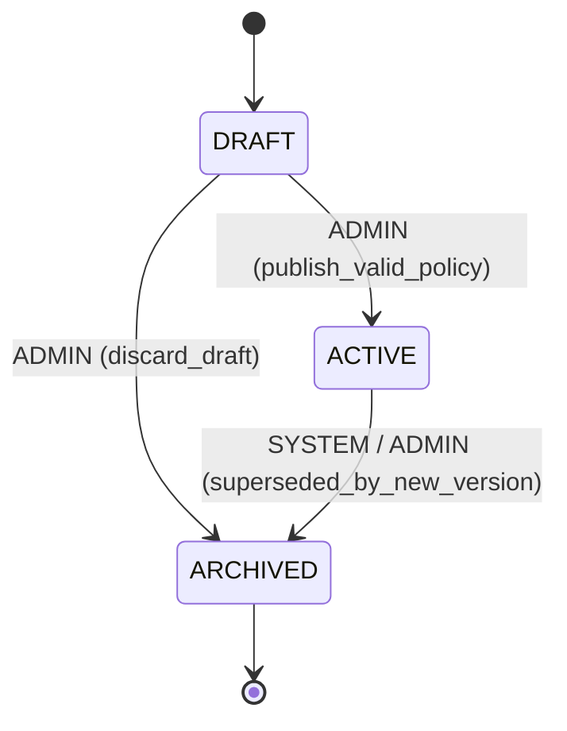

#### Estados:
- `DRAFT`: Borrador de política en edición.
- `ACTIVE`: Versión vigente oficial para el evento. Solo puede existir **una** versión activa por evento.
- `ARCHIVED` *(Terminal)*: Versión histórica superada o borrador descartado.

#### Matriz de Transiciones Válidas:

| Estado Origen | Comando / Acción | Estado Destino | Actor | Precondiciones e Invariantes | Efectos Colaterales |
|---|---|---|---|---|
| `DRAFT` | `PUBLISH_POLICY` | `ACTIVE` | `ADMIN` | Rangos continuos desde día 0, sin traslapes ni huecos, porcentajes entre 0 y 100%, rango superior abierto (`days_before_max = null`). | Archiva automáticamente la política activa anterior (`ACTIVE -> ARCHIVED`). Nueva versión inmutable. |
| `DRAFT` | `ARCHIVE_POLICY` | `ARCHIVED` | `ADMIN` | Descarte administrativo de borrador. | Marca borrador como archivado. |
| `ACTIVE` | `ARCHIVE_POLICY` | `ARCHIVED` | `ADMIN`, `SYSTEM` | Publicación de nueva versión de política para el evento. | Preserva histórico para contratos preexistentes. |

#### Transiciones Prohibidas:
- `ARCHIVED -> *` (Terminal estricto).
- `ACTIVE -> DRAFT` (Una versión publicada jamás puede volver a ser borrador editable).
- Edición directa de rangos en políticas `ACTIVE` o `ARCHIVED`.

---

### 3.9 CancellationQuote (`CancellationQuoteStatus`)

Gobierna las cotizaciones formales de cancelación previa a la baja definitiva.

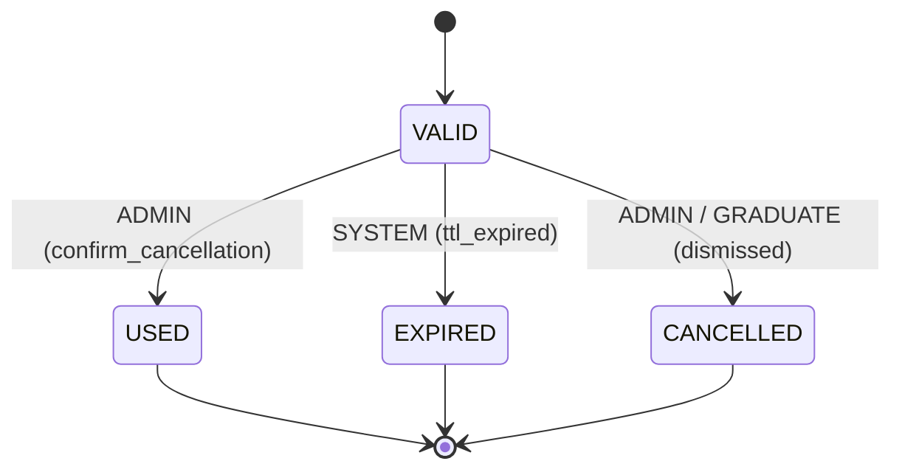

#### Estados:
- `VALID`: Cotización vigente con retención, penalización y reembolso estimados congelados.
- `USED` *(Terminal)*: Consumida para ejecutar la cancelación de la membresía.
- `EXPIRED` *(Terminal)*: Vencida por paso del tiempo o cambio de día relativo al evento.
- `CANCELLED` *(Terminal)*: Descartada sin concretar la cancelación.

#### Matriz de Transiciones Válidas:

| Estado Origen | Comando / Acción | Estado Destino | Actor | Precondiciones e Invariantes | Efectos Colaterales |
|---|---|---|---|---|
| `VALID` | `CONSUME_QUOTE` | `USED` | `ADMIN` | Utilizada en el comando de cancelación de membresía. | Fija los importes definitivos aplicados en la cancelación. |
| `VALID` | `EXPIRE_QUOTE` | `EXPIRED` | `SYSTEM` | `now() > expires_at` o cambio de fecha civil según timezone del evento. | Invalida cotización; exige recalcular con días restantes actuales. |
| `VALID` | `CANCEL_QUOTE` | `CANCELLED` | `ADMIN`, `GRADUATE` | Descarte voluntario de la cotización. | Cierra la consulta sin efectos económicos. |

#### Transiciones Prohibidas:
- `USED -> *` (Terminal).
- `EXPIRED -> *` (Terminal).
- `CANCELLED -> *` (Terminal).

---

### 3.10 Refund (`RefundStatus`)

Gobierna las órdenes y ejecuciones de devolución monetaria.

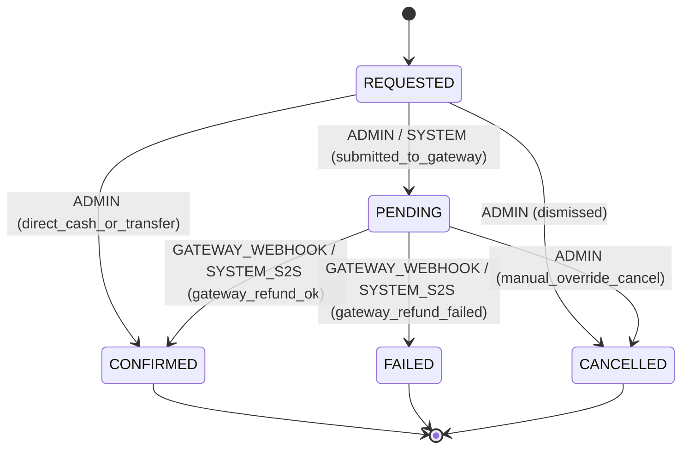

#### Estados:
- `REQUESTED`: Solicitud registrada con motivo y cálculo de saldo a favor.
- `PENDING`: En proceso de acreditación ante la pasarela de pagos.
- `CONFIRMED` *(Terminal)*: Devolución consumada y respaldada.
- `FAILED` *(Terminal)*: Rechazo de la devolución por la entidad bancaria/pasarela.
- `CANCELLED` *(Terminal)*: Cancelada administrativamente antes de ejecutarse.

#### Matriz de Transiciones Válidas:

| Estado Origen | Comando / Acción | Estado Destino | Actor | Precondiciones e Invariantes | Efectos Colaterales |
|---|---|---|---|---|
| `REQUESTED` | `SUBMIT_REFUND` | `PENDING` | `ADMIN`, `SYSTEM` | Reembolso electrónico enviado a pasarela. | Registra identificador externo del refund en pasarela. |
| `REQUESTED` | `CONFIRM_REFUND` | `CONFIRMED` | `ADMIN` | Reembolso manual (`CASH`, `TRANSFER`) verificado. Monto <= reembolsable. | Genera movimiento compensatorio contable append-only. **NO borra transacciones originales**. |
| `REQUESTED` | `CANCEL_REFUND` | `CANCELLED` | `ADMIN` | Motivo obligatorio. | Descarta la solicitud de reembolso. |
| `PENDING` | `CONFIRM_REFUND` | `CONFIRMED` | `GATEWAY_WEBHOOK`, `SYSTEM` | Webhook de pasarela confirmando éxito del reembolso. | Asienta devolución definitiva en el balance del plan. |
| `PENDING` | `FAIL_REFUND` | `FAILED` | `GATEWAY_WEBHOOK`, `SYSTEM` | Webhook de pasarela reportando fallo o rechazo bancario. | Registra mensaje de error; permite reintentar o emitir pago manual. |
| `PENDING` | `CANCEL_REFUND` | `CANCELLED` | `ADMIN` | Cancelación administrativa justificada. | Cierra el proceso de devolución. |

#### Transiciones Prohibidas:
- `CONFIRMED -> *` (Terminal estricto. Fondos devueltos inmutables).
- `FAILED -> *` (Terminal estricto; una nueva devolución requiere nuevo registro `REQUESTED`).
- `CANCELLED -> *` (Terminal estricto).
- Ejecución por rol `GRADUATE`.
- Reembolso cuyo monto supere los cobros netos elegibles confirmados.

---

### 3.11 ThermoRequest (`ThermoOperationalStatus`)

Gobierna la entrega del souvenir/termo conmemorativo.

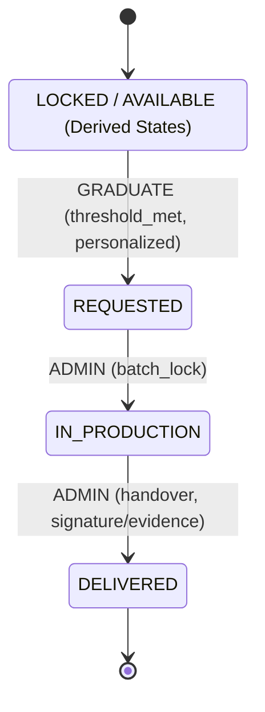

#### Estados:
- **Estados Derivados (No persistidos):**
  - `LOCKED`: Avance financiero inferior al umbral configurado por el evento.
  - `AVAILABLE`: Avance financiero >= umbral; graduado habilitado para personalizar y solicitar.
- **Estados Operativos Persistidos (`ThermoOperationalStatus`):**
  - `REQUESTED`: Solicitud formalizada con datos de personalización (nombre, tipografía, etc.).
  - `IN_PRODUCTION`: Lote enviado a taller/maquila. Personalización bloqueada contra edición.
  - `DELIVERED` *(Terminal)*: Entregado físicamente al graduado o representante acreditado.

#### Matriz de Transiciones Válidas:

| Estado Origen | Comando / Acción | Estado Destino | Actor | Precondiciones e Invariantes | Efectos Colaterales |
|---|---|---|---|---|
| *(Derivado `AVAILABLE`)* | `REQUEST_THERMO` | `REQUESTED` | `GRADUATE` | Avance financiero >= `thermo_threshold_percent`. Campos requeridos completos. | Persiste registro `ThermoRequest`, timestamp de solicitud y snapshot de personalización. |
| `REQUESTED` | `SEND_TO_PRODUCTION` | `IN_PRODUCTION` | `ADMIN` | Batch de termos enviado a grabado/fabricación. | Fija `production_at`; bloquea edición de personalización al graduado. |
| `IN_PRODUCTION` | `DELIVER_THERMO` | `DELIVERED` | `ADMIN` | Entrega física en evento o fecha designada. | Registra `ThermoDelivery`, timestamp `delivered_at`, responsable administrativo y notas/firma. |

#### Transiciones Prohibidas:
- `DELIVERED -> *` (Terminal estricto).
- `IN_PRODUCTION -> REQUESTED` (No se puede revertir un termo ya enviado a producción).
- `GRADUATE` intentando mutar el estado a `IN_PRODUCTION` o `DELIVERED`.
- Intentar persistir `LOCKED` o `AVAILABLE` como valor de base de datos.

---

### 3.12 ExportJob (`ExportJobStatus`)

Gobierna la generación asíncrona de reportes y cortes en formatos pesados (XLSX, CSV, PDF).

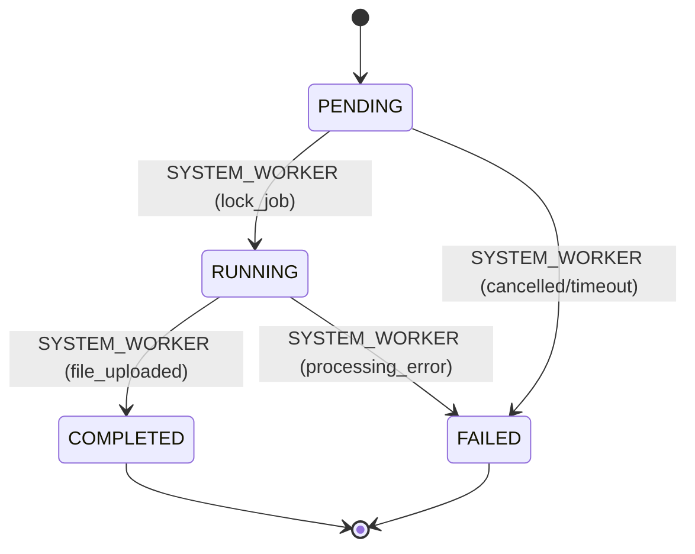

#### Estados:
- `PENDING`: Trabajo encolado en espera de un worker.
- `RUNNING`: Procesando agregaciones, consultas transaccionales y renderizado.
- `COMPLETED` *(Terminal)*: Archivo generado exitosamente y almacenado de forma segura en `FileAsset`.
- `FAILED` *(Terminal)*: Error no recuperable durante la generación.

#### Matriz de Transiciones Válidas:

| Estado Origen | Comando / Acción | Estado Destino | Actor | Precondiciones e Invariantes | Efectos Colaterales |
|---|---|---|---|---|
| `PENDING` | `START_JOB` | `RUNNING` | `SYSTEM` | Worker toma el lock del trabajo. | Registra `started_at`. |
| `PENDING` | `FAIL_JOB` | `FAILED` | `SYSTEM` | Timeout en cola o cancelación de proceso. | Registra `error_message`. |
| `RUNNING` | `COMPLETE_JOB` | `COMPLETED` | `SYSTEM` | Archivo generado y guardado en almacenamiento privado. | Asocia `file_asset_id`, `completed_at`, calcula tamaño y genera URL de descarga temporal. |
| `RUNNING` | `FAIL_JOB` | `FAILED` | `SYSTEM` | Excepción o memoria insuficiente en generación. | Registra stack trace/error seguro en `error_message` y `completed_at`. |

#### Transiciones Prohibidas:
- `COMPLETED -> *` (Terminal estricto).
- `FAILED -> *` (Terminal estricto).
- Modificación directa por usuarios externos.

---

### 3.13 ReconciliationCase (`ReconciliationCaseStatus`)

Gobierna las discrepancias operativas o financieras detectadas por los monitores automáticos (ej. conflicto de concurrencia de pagos vs capacidad, pago en pasarela sin transacción interna, etc.).

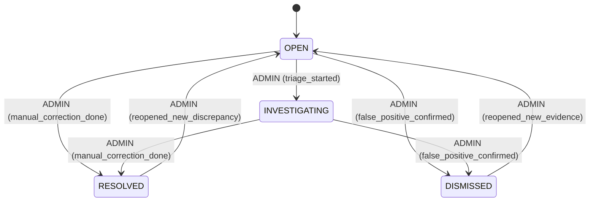

#### Estados:
- `OPEN`: Discrepancia detectada por el job de conciliación o alerta de webhook.
- `INVESTIGATING`: Caso asignado a un administrador para triaje, auditoría y análisis de causa raíz.
- `RESOLVED`: Corregido formalmente mediante ajuste contable, re-asignación o devolución.
- `DISMISSED`: Descartado formalmente tras comprobar que no constituía una falla real (ej. pago duplicado devuelto en origen).

#### Matriz de Transiciones Válidas:

| Estado Origen | Comando / Acción | Estado Destino | Actor | Precondiciones e Invariantes | Efectos Colaterales |
|---|---|---|---|---|
| `OPEN` | `INVESTIGATE_CASE` | `INVESTIGATING` | `ADMIN` | Asignación de caso y nota de triaje. | Registra timestamp y actor de inicio de investigación. |
| `OPEN` | `RESOLVE_CASE` | `RESOLVED` | `ADMIN` | Resolución documentada con nota y acción correctiva asociada. | Fija `resolved_at`, `resolved_by_account_id` y motivo de resolución. |
| `OPEN` | `DISMISS_CASE` | `DISMISSED` | `ADMIN` | Justificación de falso positivo obligatoria. | Fija `dismissed_at` y motivo. |
| `INVESTIGATING` | `RESOLVE_CASE` | `RESOLVED` | `ADMIN` | Acción correctiva aplicada y verificada. | Fija resolución formal del caso. |
| `INVESTIGATING` | `DISMISS_CASE` | `DISMISSED` | `ADMIN` | Descarte justificado con evidencia. | Registra auditoría de descarte. |
| `RESOLVED` | `REOPEN_CASE` | `OPEN` | `ADMIN` | Nueva evidencia o reaparición de inconsistencia. Motivo requerido. | Reactiva alerta operativa en dashboards de administración. |
| `DISMISSED` | `REOPEN_CASE` | `OPEN` | `ADMIN` | Descarte erróneo refutado. Motivo requerido. | Reactiva el caso para triaje. |

#### Características Especiales:
- `RESOLVED` y `DISMISSED` **NO son terminales irreversibles**: admiten reapertura (`REOPEN_CASE`) exclusivamente por rol `ADMIN` con justificación explícita de auditoría.
- Prohibida cualquier interacción por usuarios con rol `GRADUATE`.

---

## 4. Resumen Consolidado de Terminalidad y Reversibilidad

| Máquina de Estado | Estados No Terminales | Estados Reversibles / Reabribles | Estados Terminales Irreversibles |
|---|---|---|---|
| `Event` | `DRAFT`, `OPEN` | `CLOSED` (puede reabrir a `OPEN`) | `FINALIZED`, `CANCELLED` |
| `GraduateMembership` | `ACTIVE` | Ninguno | `CANCELLED`, `COMPLETED` |
| `GraduateContract` | `PENDING_ACCEPTANCE` | Ninguno | `ACCEPTED` (inmutable), `SUPERSEDED`, `CANCELLED` |
| `ContractLineItemQuote` | `VALID` | Ninguno | `APPLIED` (`USED`), `EXPIRED`, `CANCELLED` |
| `PaymentPlan` | `ACTIVE` | `SETTLED` (vuelve a `ACTIVE` si hay adendas) | `CANCELLED` |
| `PaymentAttempt` | `CREATED`, `REDIRECTED`, `PENDING` | Ninguno | `CONFIRMED`, `FAILED`, `EXPIRED`, `CANCELLED` |
| `PaymentSubmission` | `PENDING_REVIEW` | Ninguno | `APPROVED`, `REJECTED`, `CANCELLED` |
| `CancellationPolicy` | `DRAFT` | Ninguno | `ACTIVE` (inmutable), `ARCHIVED` |
| `CancellationQuote` | `VALID` | Ninguno | `USED`, `EXPIRED`, `CANCELLED` |
| `Refund` | `REQUESTED`, `PENDING` | Ninguno | `CONFIRMED`, `FAILED`, `CANCELLED` |
| `ThermoRequest` | *(Derivados)*, `REQUESTED`, `IN_PRODUCTION` | Ninguno | `DELIVERED` |
| `ExportJob` | `PENDING`, `RUNNING` | Ninguno | `COMPLETED`, `FAILED` |
| `ReconciliationCase` | `OPEN`, `INVESTIGATING` | `RESOLVED`, `DISMISSED` (ambos pueden reabrir a `OPEN`) | Ninguno (auditoría perpetua) |

---

## 5. Arquitectura del Domain Transition Guard

Para garantizar el cumplimiento de estas reglas en tiempo de ejecución, el backend implementa:

```text
backend/src/common/state-machines/
├── state-machine.types.ts           # Definición de entidades, estados, comandos y actores
├── state-machine.definitions.ts     # Tabla formal y ejecutable de transiciones permitidas
├── domain-state-guard.service.ts    # Guard de dominio inyectable con validación de invariantes
└── state-machines.module.ts         # Módulo NestJS exportable
```

### Reglas de Ejecución:
1. Ningún service o command handler altera columnas de estado directamente sin invocar `domainStateGuard.assertTransition(...)`.
2. Las transiciones idempotentes retornan un resultado marcado como `idempotent: true`, permitiendo que llamadas duplicadas sean seguras sin lanzar excepciones indeseadas ni duplicar efectos secundarios.
3. Todo intento de persistir estados derivados (`PAID`, `OVERDUE`, `FULL`, `PARTIAL`, `LOCKED`, `AVAILABLE`) arroja una excepción `DerivedStatePersistAttemptException` de severidad crítica.
